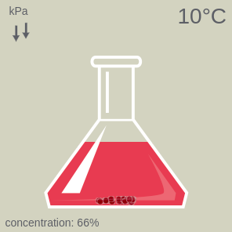

# concentration
Educational simulation: concentration of a solute

This educational simulation encourages users to explore the effects of different variables on the concentration of a solute within a solvent.

Try different solute amounts, temperatures, and containers to see their effect on concentration.

This was developed with HTML5 and uses functional reactive programming techniques.

Running simulation at <a href="http://www.bonthron.com">www.bonthron.com</a>

